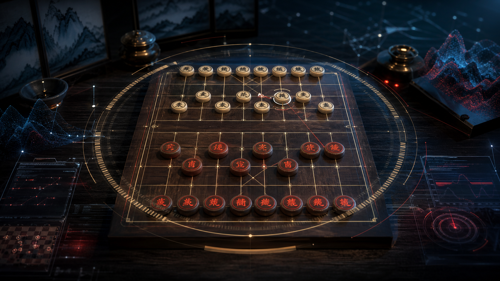
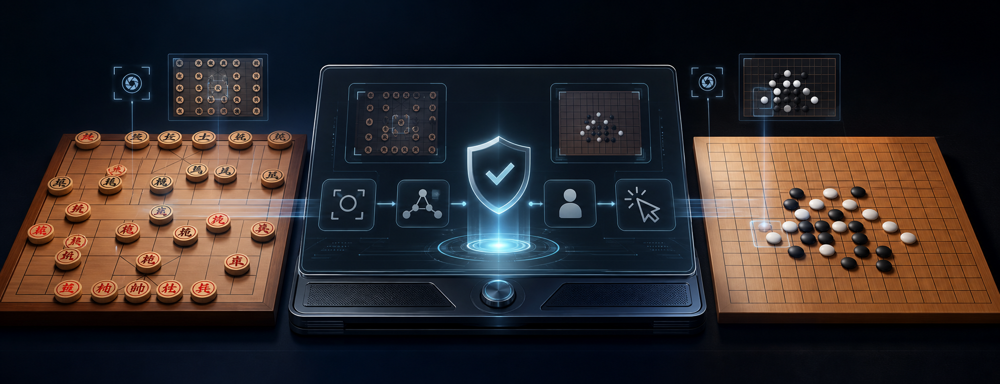
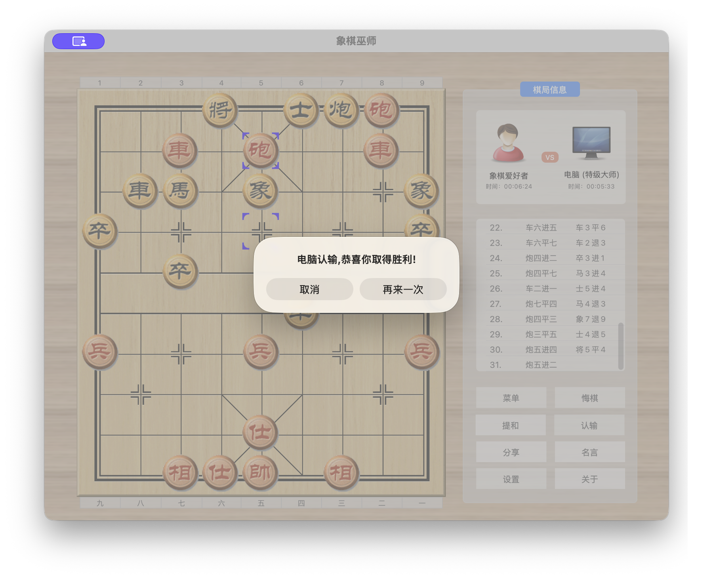
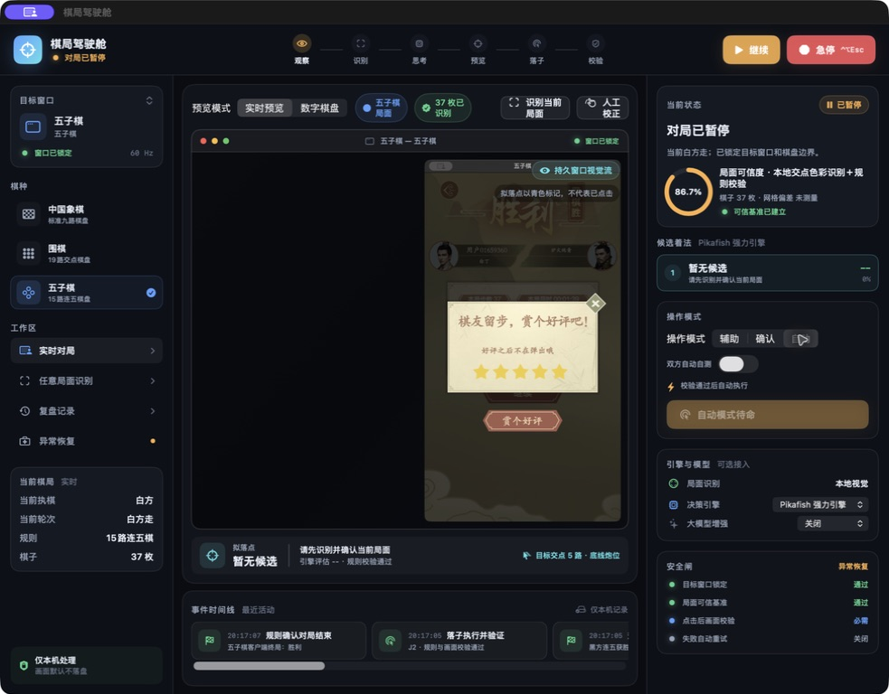
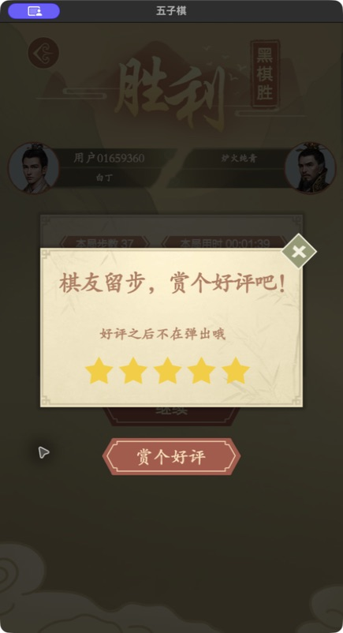
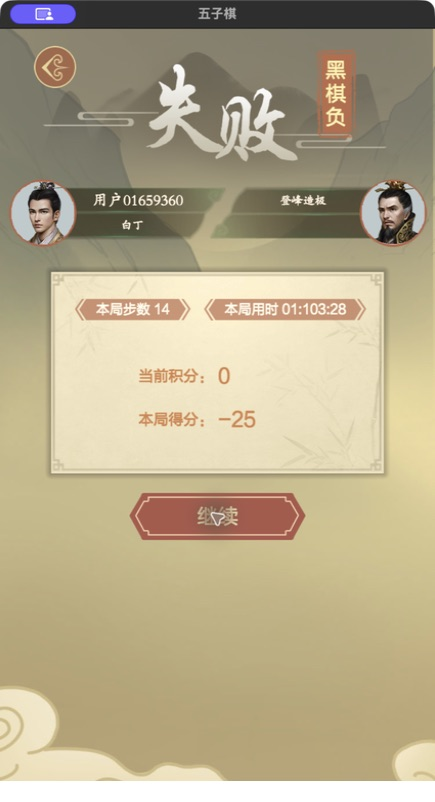

<div align="center">



# XiangqiPilot

### 让电脑看懂棋盘，也让每一步操作都先想清楚、再动手

这是一个运行在 macOS 上的棋盘游戏驾驶舱。它可以看棋盘、认局面、找走法、接入引擎，也可以在确认安全之后帮你点击下一步。

**简体中文** · [繁體中文](docs/README.zh-TW.md) · [English](docs/README.en.md) · [日本語](docs/README.ja.md) · [한국어](docs/README.ko.md) · [Español](docs/README.es.md) · [Français](docs/README.fr.md) · [Deutsch](docs/README.de.md) · [Português](docs/README.pt-BR.md) · [Русский](docs/README.ru.md) · [العربية](docs/README.ar.md) · [हिन्दी](docs/README.hi.md) · [Bahasa Indonesia](docs/README.id.md)

Contact: **Jacksun** · [qinji@jack-sun.com](mailto:qinji@jack-sun.com)


</div>

<p align="center">
  
</p>

<p align="center"><i>一个框架，多种棋盘；先观察，再判断，最后才执行。</i></p>

## 先说人话：它到底是什么？

你可以把 XiangqiPilot 理解成一个“会看棋盘的电脑助手”。

它不是只会给你一句“这步应该走炮二平五”的聊天机器人，也不是看到一个按钮就直接乱点的脚本。它会先确认：

- 我现在看的，真的是目标棋盘吗？
- 棋盘的位置有没有变？窗口有没有被拖动或缩放？
- 画面里的棋子、棋子颜色和当前轮次，能不能互相对得上？
- 这一步在真实规则里是否合法？
- 从我看见画面到我准备点击，中间有没有发生变化？

只有这些问题基本都说得通，它才会给出建议；涉及实际点击时，还会再检查一遍。

一句话概括：**它想帮你操作，但不会把“猜测”当成“事实”。**

## 它现在能做什么？

| 场景 | 用大白话解释 |
| --- | --- |
| 中国象棋 | 标准新局直接载入规则局面；后续只验证交点变化是否唯一对应一着合法棋，再调用内置引擎或 Pikafish 分析 |
| 五子棋 | 识别黑白棋子和网格变化，判断是否形成五连，分析下一步，并同步网页棋局 |
| 网格棋基础 | 底层已经支持网格坐标、落子、吃子、停着和终局判断，方便继续扩展其他棋盘游戏 |
| 网页棋谱同步 | 从已知的棋局页面读取最新落子，作为画面识别之外的另一份证据 |
| 自动点击 | 只有目标窗口、棋盘位置、局面和候选落点都通过检查后，才会执行点击 |
| 失败诊断 | 如果它不敢走，会告诉你是棋盘变了、识别不完整、状态过期，还是权限或窗口有问题 |

## 象棋主链：不靠每种皮肤读“车马炮兵”

当前象棋的默认工作流是“从标准新局开始”。完成棋盘四角标定后，驾驶舱直接建立 32 子标准规则局面；棋子身份此后由本地棋规和每一手经过验证的走法持续维护，而不是每一帧重新 OCR 棋子文字。

每次真实棋盘变化都必须同时满足：

- 只绑定一个 macOS `windowID`，不扫描整块桌面；
- 变化对应唯一的一着合法棋；
- 起点和终点是严格的两个变化交点；
- 棋盘区域在连续两帧中稳定；
- 每次点击后，由同样的严格视觉回读或客户端官方走棋记录确认。

因此不同客户端真正需要适配的只有窗口、棋盘区域、官方走棋记录和点击回执；规则核心、引擎和增量同步是一套通用代码。象棋巫师和已知网页棋局优先使用官方走棋记录，宽立等纯视觉客户端使用严格交点差分。

中途接入残局或局面丢失时，才进入全盘视觉/云端复核。复核只能生成候选和差异草稿，不能静默覆盖已建立的规则局面。

当前通用 14 类本地棋子检测模型尚未随应用分发，界面会明确显示“本地14类模型未安装”；现有 OCR 和客户端模板只作为冷路径恢复候选，不会冒充任意中局的权威识别。实时主链不受这个限制，因为它只维护上一可信规则局面并验证每一手变化。

## 你实际会看到什么？

### 中国象棋：不是只看棋，还会确认结果

下面是真实验证截图。可以看到，棋局结束后，应用能识别“电脑认输”的结果，并把这次过程留在验证记录里。

<p align="center">
  
</p>

### 五子棋：驾驶舱会把当前状态讲清楚

五子棋模式不只是一个棋盘预览，它会同时展示当前窗口、识别到的棋盘、当前轮次、候选走法、引擎来源和安全检查结果。

<p align="center">
  
</p>

终局页面也会单独保存，方便回看“到底是怎么赢的、页面最后显示了什么”。

<p align="center">
  
  
</p>

## 它是怎么工作的？

可以把一次完整流程想成下面七步：

1. **找到窗口**：确认要看的棋盘在哪个应用里。
2. **校准棋盘**：知道棋盘的边界、格子和每个落点对应的屏幕坐标。
3. **同步局面**：标准新局直接建立规则盘面；后续读取棋盘变化、官方走棋记录和可能的终局提示。
4. **按规则检查**：不管模型怎么说，先问规则引擎这步是否合法。
5. **算几个候选**：用内置引擎、Pikafish 或网格棋引擎给出建议。
6. **再确认一次**：检查窗口、画面序号、局面哈希和落点有没有过期。
7. **执行后复核**：点击以后重新看棋盘，确认现实中的棋局真的变了。

<p align="center">
  
</p>

核心不是“自动点击”，而是最后那句：**点完以后还要回头看，不能默认点击一定成功。**

## 为什么不直接让 AI 决定？

因为棋盘自动化有一个很现实的问题：画面可能会骗人。

比如窗口刚好移动了一点，截图可能还是清楚的，但原来的点击坐标已经不对了；又比如棋子上的字被高光遮住了，模型可能会把一个炮看成车。XiangqiPilot 的做法是把不同来源的信息放在一起对照：

- 画面识别说“这里有棋子”
- 棋盘规则说“这个棋子这样走才合法”
- 网页棋谱说“刚才真正落的是这一步”
- 引擎说“从当前局面看，这几步比较值得考虑”
- 用户确认说“现在可以执行”

如果这些信息互相冲突，应用宁愿停下来，也不会硬点。

## 哪些情况下它会主动停手？

下面这些情况都属于“停下来是正确答案”：

- 棋盘窗口被拖动、缩放，或者目标窗口已经不是原来的窗口
- 当前画面和准备执行的局面不是同一帧
- 中途接入的全盘识别出现棋子数量、颜色或位置不合理
- 模型返回了不可能的局面或不合法的走法
- 网页正在切换页面，上一局结果还盖在当前棋盘上
- 用户按下暂停或紧急停止
- macOS 没有给屏幕录制或辅助功能权限

这也是为什么界面里会有“观察、识别、预览、确认、执行、复核”这些状态，而不是一个永远亮着的“自动开始”按钮。

## 当前项目的两条主线

### 中国象棋：规则完整，支持引擎分析

中国象棋部分包含棋盘、局面、走法合法性、将军、将杀、困毙、飞将和重复局面等基础规则。没有外部模型时，也可以使用内置搜索引擎完成基本分析。

如果放入经过验证的 Pikafish 和 NNUE 网络，构建脚本会把它们签名并打进应用包里。Pikafish 不可用时，应用会回退到内置引擎。

### 五子棋：从截图识别到网页棋局同步

五子棋部分使用通用网格棋结构处理棋盘坐标、黑白落子、五连判断和终局识别。它还支持读取已知网页棋局的 ICCS 落子记录，避免只依赖截图中的最后一个像素变化。

底层网格规则也已经开始支持围棋式的吃子、停着和计分，为后续扩展其他网格棋留出空间。

## 设计上最重要的几个概念

### 驾驶舱，不是脚本窗口

你可以在同一个界面看到：当前目标窗口、识别到的棋盘、候选走法、引擎来源、运行状态和安全检查。它希望把“电脑正在想什么”讲清楚。

### 观察和执行分开

识别、分析、预览和点击不是同一件事。应用先看，再想，再给出候选，最后才在条件满足时执行。

### 本地优先

棋盘规则、基础搜索、状态校验和大部分安全判断都在本地完成。外部视觉模型只是辅助，不是唯一裁判。模型密钥通过 macOS Keychain 保存，不写进项目文件。

### 可恢复、可诊断

失败并不只是弹一句“失败了”。运行时会记录失败原因、状态变化和相关诊断，方便知道下一步应该重新校准、重新识别、恢复窗口，还是补充权限。

## 快速开始

### 环境要求

- macOS 14 或更高版本
- Xcode 26 或更高版本
- 推荐 Apple Silicon Mac

```bash
git clone git@github.com:sunqinji666-dotcom/xiangqi-pilot.git
cd xiangqi-pilot

# 运行全部测试
scripts/test.sh

# 第一次使用这台 Mac 时，创建本地签名身份
scripts/setup-local-signing.sh

# 构建并签名应用
scripts/build-app.sh
```

首次运行可能需要在“系统设置 → 隐私与安全性”里允许：

- 屏幕录制：让应用看见目标棋盘窗口
- 辅助功能：让应用在确认后执行鼠标操作

### AI 协同：AI 读盘和点击，驾驶舱只做规则与决策

在驾驶舱选择“AI协同决策”后，应用不会请求屏幕录制、不会绑定棋盘窗口，也不会发出鼠标点击；它会在本机 Unix Socket 上等待 AI 提交当前 FEN，先用本地象棋规则校验局面，再返回引擎候选（UCCI）。AI 使用自己的画面识别和点击能力完成观察与落子。

Socket 路径为 `~/Library/Application Support/XiangqiPilot/ai-bridge.sock`，消息采用逐行 JSON。可用随附脚本提交一次识别结果：

```bash
node scripts/submit-ai-recognized-position.mjs \
  'rnbakabnr/9/1c5c1/p1p1p1p1p/9/9/P1P1P1P1P/1C5C1/9/RNBAKABNR w' 0.98
```

收到 `accepted` 确认后，桥接会发送 `candidateReady`，其中包含校验后的 FEN、候选 UCCI 走法和引擎评估。协同模式不接收远程“恢复自动点击”指令，防止 AI 误把本机自动化重新开启。

## 项目结构，简单看

```text
XiangqiPilot/
├── Sources/XiangqiCore/              # 中国象棋和网格棋规则、局面、引擎
├── Sources/XiangqiPilotApp/
│   ├── Intelligence/                 # 模型网关、Keychain、计费
│   ├── Connection/                   # windowID 连线、90点热路径、局面同步
│   ├── Recognition/                  # 棋盘识别、棋谱读取、变化验证
│   ├── Runtime/                      # 运行时状态与安全编排
│   ├── Services/                     # 采集、校准、权限、点击执行
│   ├── Setup/                        # 首次设置和棋盘校准
│   └── Views/                        # 驾驶舱界面
├── Tests/                            # 规则、识别、安全和运行时测试
├── docs/validation/                  # 实际棋局验证截图
├── Vendor/Pikafish/                  # 可选中国象棋引擎
└── scripts/                          # 测试、构建和签名脚本
```

## 现在做到什么程度了？

项目还在积极开发，但已经不是一个只有界面草稿的原型：

- 中国象棋和五子棋的核心规则已经有自动化测试
- 真实窗口采集、棋盘校准、局面识别和安全点击已经串成闭环
- 支持象棋巫师和已知网页棋局的落子记录读取
- 五子棋已经完成真实 37 手对局验证和终局页面验证
- 当前版本：**v0.5.0（构建号 5）**
- 最近一次本地检测：**109 个 Swift 测试 + 2 个桥接脚本测试，全部通过**

它仍然有边界：不同网站的页面布局、棋盘皮肤、弹窗和权限设置可能不同；没有经过校准和验证的页面，不应该直接开启自动点击。

## 许可证与第三方声明

XiangqiPilot 自身采用 [MIT License](LICENSE) 开源。Pikafish 及其网络文件遵循各自的许可证和分发要求，详见 [`THIRD_PARTY_NOTICES.md`](THIRD_PARTY_NOTICES.md)。

如果你想了解某个功能为什么会停、某一步是怎么判断的，优先看 `RuntimeDiagnostics`、`Recognition` 和 `Tests` 里的对应实现与测试。
