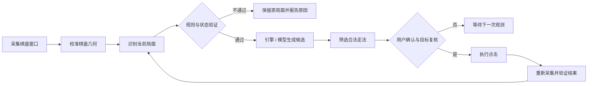

<div align="center">

# XiangqiPilot

### 把棋盘识别、局面理解、引擎分析与安全执行串成一条可追溯的桌面工作流

一个面向 macOS 的中国象棋智能驾驶舱：看见棋盘，理解局面，给出建议，在确认之后执行下一步。


</div>

<p align="center">
  
</p>

<p align="center"><i>让棋盘成为可观察、可验证、可复核的智能工作空间。</i></p>

<br />

## 这是什么？

XiangqiPilot 不是一个只会“看图说棋”的聊天窗口，而是一套把视觉、规则、引擎和桌面交互连接起来的本地应用。

它可以从棋盘窗口采集画面，完成棋盘校准与局面识别，用中国象棋规则验证候选局面，再结合内置搜索引擎或兼容 OpenAI API 的视觉模型生成建议。真正执行点击之前，系统还会检查棋盘几何、画面序列和局面哈希，避免在过期或不确定的状态下误操作。

> 核心理念：模型可以提出意见，但规则、状态和用户确认才拥有最终决定权。

## 你可以用它做什么？

| 能力 | 作用 |
| --- | --- |
| 棋盘采集与校准 | 锁定目标窗口，建立棋盘坐标系，处理透视和边界留白 |
| 局面识别 | 结合视觉识别、差分帧和规则约束理解棋盘变化 |
| 中国象棋规则 | 检查走法合法性、将军、将杀、困毙、飞将和重复局面 |
| 引擎分析 | 使用内置 Alpha-Beta 搜索，也可接入经过验证的 Pikafish |
| 视觉模型复核 | 支持 OpenAI-compatible 接口，例如阿里云百炼兼容接口 |
| 安全执行 | 只在目标、状态和落点都匹配时执行桌面点击 |
| 可诊断运行时 | 记录失败原因、状态转换和交互链路，便于定位问题 |

## 它是怎么工作的？

一次完整的分析和执行，大致经过下面这条链路：

<p align="center">
  
</p>

这张概念图对应的不是一条“模型说了算”的直线，而是一条带有确认门的闭环：每一次动作都要从现实棋盘重新获得证据。



这里最重要的不是“自动化”三个字，而是闭环：执行之后必须重新观察棋盘，确认现实状态真的发生了预期变化。

## 设计概念

### 1. 驾驶舱，而不是单一按钮

界面采用 cockpit / dashboard 的组织方式，把当前棋盘、运行状态、候选走法、检查结果和诊断信息放在同一个工作空间中。用户始终能看到系统“看到了什么、准备做什么、为什么这样做”。

### 2. 观察和执行分离

系统先观察，再分析，再提出建议，最后才进入执行阶段。任何一步出现不确定性，都会回退到可解释的失败状态，而不是继续猜测。

### 3. 多重证据，而不是单点信任

一个模型的判断不足以改变棋盘状态。局面恢复和走法执行还需要结合：

- 棋盘几何是否仍然匹配
- 当前画面序列是否新鲜
- 局面哈希是否与提议时一致
- 棋子库存和走法是否符合中国象棋规则
- 起点、终点和目标窗口是否精确匹配

### 4. 本地优先，密钥隔离

模型密钥通过 macOS Keychain 保存，代码仓库只保存配置和账户标识，不保存真实 API Key。没有外部模型时，应用仍可使用内置规则和搜索引擎完成基础分析。

## 快速开始

### 环境要求

- macOS 14 或更高版本
- Xcode 26 或更高版本
- Apple Silicon Mac 推荐

确认命令行工具指向完整 Xcode：

```bash
xcode-select -p
# 应为 /Applications/Xcode.app/Contents/Developer
```

### 构建与测试

```bash
git clone git@github.com:sunqinji666-dotcom/xiangqi-pilot.git
cd xiangqi-pilot

# 运行全部测试
scripts/test.sh

# 第一次使用这台 Mac 时，创建稳定的本地代码签名身份
scripts/setup-local-signing.sh

# 构建并签名应用
scripts/build-app.sh
```

安装到稳定路径并启动：

```bash
ditto "dist/棋局驾驶舱.app" "/Applications/棋局驾驶舱.app"
open "/Applications/棋局驾驶舱.app"
```

### macOS 权限

首次运行时，应用可能需要：

1. 在“系统设置 → 隐私与安全性 → 屏幕录制”中允许屏幕采集
2. 在“系统设置 → 隐私与安全性 → 辅助功能”中允许执行桌面交互
3. 重新启动应用，让权限与稳定签名身份绑定

如果是从旧的 ad-hoc 构建迁移，可以只重置本应用的旧授权：

```bash
tccutil reset ScreenCapture com.jacksun.xiangqi-pilot
tccutil reset Accessibility com.jacksun.xiangqi-pilot
```

## 模型与引擎

### 内置引擎

`Sources/XiangqiCore` 包含棋盘模型、走法规则、局面管理和 Alpha-Beta 搜索。即使没有网络或外部模型，也可以运行基础的合法性检查与候选走法搜索。

### Pikafish

如果把经过验证的 Pikafish 可执行文件和 NNUE 网络放入：

```text
Vendor/Pikafish/pikafish
Vendor/Pikafish/*.nnue
```

打包脚本会在构建时签名并嵌入它。Pikafish 是 GPL-3.0 软件，分发包含它的应用时，必须同时满足其源代码和许可证义务。项目中的 `THIRD_PARTY_NOTICES.md` 和应用包内的许可证文件用于保留相关声明。

如果 Pikafish 不存在或启动失败，应用会自动回退到内置引擎。

### OpenAI-compatible 模型接口

模型配置位于 `Sources/XiangqiPilotApp/Intelligence/`。当前内置了阿里云百炼兼容接口的配置示例，密钥通过 Keychain 读取。模型调用会记录 token 用量、耗时和估算费用，但不会把密钥写入项目文件。

## 项目结构

```text
XiangqiPilot/
├── Sources/
│   ├── XiangqiCore/                 # 棋盘、规则、局面和搜索引擎
│   └── XiangqiPilotApp/
│       ├── Intelligence/            # 模型网关、Keychain、计费
│       ├── Recognition/              # 视觉识别、局面恢复、安全策略
│       ├── Runtime/                  # 运行时编排与诊断
│       ├── Services/                 # 采集、校准、权限和点击执行
│       ├── Setup/                    # 首次设置与校准向导
│       └── Views/                    # 驾驶舱界面
├── Tests/                            # 规则、识别、安全与运行时测试
├── Packaging/                        # macOS 应用元数据
├── scripts/                          # 测试、构建和本地签名脚本
└── THIRD_PARTY_NOTICES.md            # 第三方组件与许可证说明
```

## 测试覆盖的关键边界

项目测试不只验证“能不能走棋”，还覆盖了自动化场景中最容易出问题的边界：

- 规则合法性、将杀、困毙和飞将
- 棋盘透视校准与边界坐标
- OCR 漂移和不完整识别
- 过期画面、过期提议和局面哈希变化
- 模型给出不可能局面时的拒绝策略
- 点击失败的诊断信息与安全回退
- 引擎候选数量、搜索取消和思考等级
- 模型计费的确定性计算

运行测试：

```bash
scripts/test.sh
```

## 开发约定

一个建议的开发闭环是：

1. 先在 `XiangqiCore` 或安全策略中写清楚状态和规则
2. 为正常路径和拒绝路径补测试
3. 在 `PilotRuntime` 中接入编排逻辑
4. 在 `Views` 中呈现状态、理由和可恢复动作
5. 构建签名后，用真实窗口做一次采集—分析—确认—复核闭环

提交前建议运行：

```bash
scripts/test.sh
git diff --check
git status
```

## 当前状态

项目处于积极开发阶段。基础棋盘规则、视觉识别、安全执行、运行时诊断和 Pikafish 集成已经形成完整骨架，界面和模型工作流仍会持续迭代。

最近一版重点强化了：

- 更严格的 ASCII / FEN 视觉模型约束，以及少量本地漏检棋子的安全补回
- 更稳的棋盘占位检测与画面帧差分，减少缩放、字形和选中态带来的误判
- 自动模式执行去重、状态门控和执行前二次复核
- 控制模式切换、暂停恢复与诊断事件的联动
- GitHub 首页视觉资产与设计概念说明，帮助读者快速理解项目边界

## 许可证与第三方声明

XiangqiPilot 自身的许可证策略仍在确定中。Pikafish 及其网络文件遵循各自的许可证和分发要求，详见 [`THIRD_PARTY_NOTICES.md`](THIRD_PARTY_NOTICES.md)。
